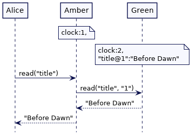
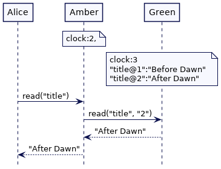
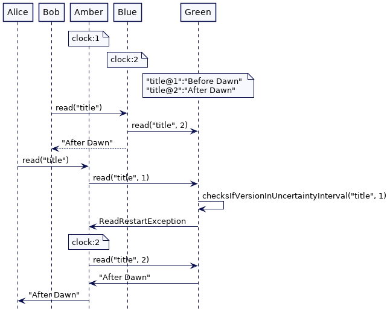
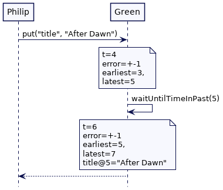
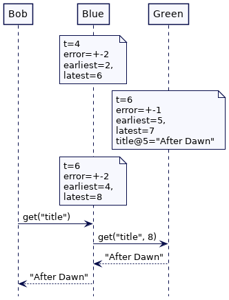
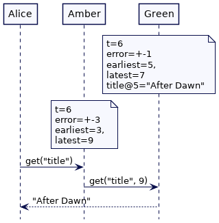
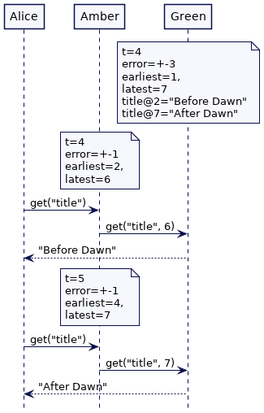
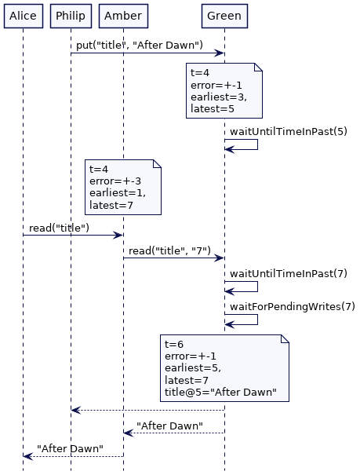

# 以时钟为限的等待（Clock-Bound Wait）

**原文**

https://martinfowler.com/articles/patterns-of-distributed-systems/clock-bound.html

集群节点之间存在**时间不确定性**，因此需要在**读取**和**写入**之前等待，以使**值**能在集群节点之间正确排序。

**2022.8.17**

## 问题

考虑一个 KV（键值）存储，其中存储**V**时携带**时间戳**来区别每个版本。

客户端请求集群任何节点时，携带客户端的当前时间戳就能读取到**V**的最新版本。

如下面例子所示，按照格林时钟，值`Before Dawn`在时刻**2**时被更新为`After Dawn`。

Alice 和 Bob 都尝试读取`title`的最新版本值。 Alice 的请求由集群节点 Amber 处理，Bob 的请求由集群节点 Blue 处理。
节点 Amber 的时钟滞后，处于时刻**1**； 这意味着当 Alice 读取最新值时，节点会返回`Before Dawn`。
节点 Blue 时钟为时刻**2**；当 Bob 读取最新值时，返回值为`After Dawn`。

> Alice 和 Bob 都可以向格林时钟服务器获取`key`的最新版本时间戳；但这需要额外一轮请求。
> 如果 Alice 和 Bob 尝试从多个服务器节点中读取多个`key`，需要获取每个`key`的最新版本并选取最新版本的值。


这违反了[外部一致性](https://cloud.google.com/spanner/docs/true-time-external-consistency)。 如果 Alice 和 Bob 正在打电话沟通，Alice 会很困惑；
Bob 会说`title`的最新值是`After Dawn`，而 Alice 的节点显示的`title`仍然是`Before Dawn`。

似乎节点 Blue 的值写入发生在”未来“。

如果以**系统时间戳**作为存储值的版本，就会引起这样的问题，因为[系统时钟不是单调的](https://martinfowler.com/articles/patterns-of-distributed-systems/time-bound-lease.html#wall-clock-not-monotonic)。
来自不同服务器节点的时钟值不能也不应该进行比较。
当[混合时钟](./hybrid-clock.md)用作[版本值](./versioned-value.md)中的版本时，就能在单个服务器、以及因果相关的不同服务器上进行版本排序。
然而，混合时钟（或者任何基于 [Lamport Clock](./lamport-clock.md) 的时钟实现）都只能给出[部分顺序（partial order）](https://martinfowler.com/articles/patterns-of-distributed-systems/lamport-clock.html#PartialOrder)。
这就意味着不存在因果关系且分布在不同节点上值是无法排序的。
当使用**时间戳**读取集群不同节点值时，会引起问题：如果读取时钟滞后节点，那么节点可能无法返回值的最新版本。

## 解决方案

读取或写入值时，集群节点会陷入等待，直到集群中每个节点上的时间戳都高于请求时间戳。

如果时钟之间的间隔非常小，则写入请求可以等待，且不会造成大量开销。
例如，假设集群节点之间的最大时钟间隔为 `10 ms`。（这意味着，在任何时间点，集群中最慢的节点时钟落后 10ms。）
为了保证每个集群节点的时钟戳都大于`t`，处理写操作的节点需要在存储值之前等待 10ms。

一个具有[版本](./versioned-value.md)的 KV 存储，每个更新操作都是一个追加操作，并使用时间戳作为版本号。
在上面提到的 Alice 和 Bob 例子中，写入`title@2`的操作将等待集群所有节点的时钟戳都处于 2。
这确保 Alice 始终会看到`title`的最新值，即使该节点时钟戳落后于其它节点。

考虑一个稍微不同的场景。 格林时间为`2`，Philip 正在将`title`更新为'After Dawn'。
Green 知道，此时写入可能有一台服务器的时间落后 1 个单位。因此，它必须在写入操作中等待 1 个单位时间。


当 Philip 在更新`title`时，Bob 正在读取`title`，且读取请求由节点 Blue 处理。
节点 Blue 时间处于 2，因此它尝试读取时间戳为 2 的`title`。
此时节点 Green 尚未提供可用的值。 这意味着 Bob 读取到了小于时间戳 2 的值，即'Before Dawn'。


Alice 的读取请求由节点 Amber 处理。 节点 Amber 的时间戳为 1，因此它尝试读取时间戳 1 处的`title`。Alice 读取到值'Before Dawn'。



一旦 Philip 的写入完成（max_diff 的等待结束后），如果 Bob 现在发送新的读取请求，节点 Blue 将尝试根据其时间戳读取最新值（时间戳已到 3）；
这将返回值'After Dawn'。


如果 Alice 发起一个新的读取请求，节点 Blue 将根据其时间戳（现在为 2）读取`title`最新值。因此，它也会返回值'After Dawn'。



解决方案的主要问题是，使用普通可用的日期/时间硬件和操作系统 API 根本不可能获得集群节点之间的准确时间差。

因此 Google 有自己的专门日期时间 API，称为 [True Time](https://cloud.google.com/spanner/docs/true-time-external-consistency)。
同样，亚马逊有 [AWS 时间同步服务](https://aws.amazon.com/about-aws/whats-new/2021/11/amazon-time-sync-service-generate-compare-timestamps/)和一个名为 [ClockBound](https://github.com/aws/clock-bound)的库。 然而，这些 API 是针对 Google 和 Amazon 的，其它企业和组织无法使用。

通常 KV 存储使用[混合时钟](./hybrid-clock.md)来实现[版本化](./versioned-value.md)。
虽然这也不可能获得时钟之间的确切差异，但可以根据历史观察选择合理的默认值。
观察发现，跨数据中心的服务器上的最大时钟偏差的通常为 200 到 500 ms。

KV 存储在存储值之前需要等待最大时钟偏差（可配置）。

```java
class KVStore {
  // ...
  int maxOffset = 200;
  NavigableMap<HybridClockKey, String> kv = new ConcurrentSkipListMap<>();
  public void put(String key, String value) {
      HybridTimestamp writeTimestamp = clock.now();
      waitTillSlowestClockCatchesUp(writeTimestamp);
      kv.put(new HybridClockKey(key, writeTimestamp), value);
  }

  private void waitTillSlowestClockCatchesUp(HybridTimestamp writeTimestamp) {
      var waitUntilTimestamp = writeTimestamp.add(maxOffset, 0);
      sleepUntil(waitUntilTimestamp);
  }

  private void sleepUntil(HybridTimestamp waitUntil) {
      HybridTimestamp now = clock.now();
      while (clock.now().before(waitUntil)) {
          var waitTime = (waitUntil.getWallClockTime() - now.getWallClockTime()) ;
          Uninterruptibles.sleepUninterruptibly(waitTime, TimeUnit.MILLISECONDS);
          now = clock.now();
      }
  }

  public String get(String key, HybridTimestamp readTimestamp) {
      return kv.get(new HybridClockKey(key, readTimestamp));
  }
}
```

### 再次读取（Read Restart）

200 ms 的等待对于每个写入请求的耗时而言太长了。 这就是为什么 [CockroachDB](https://www.cockroachlabs.com/docs/stable/) 或 [YugabyteDB](https://www.yugabyte.com/) 这类数据库会改成在读取请求中检查。

当节点处理读取请求时，节点会检查在 `readTimestamp` 和 `readTimestamp + maximum clock`的时间间隔内是否有可用的数据版本。
如果可用版本的时间戳滞后，节点会要求客户端使用该版本重新读取。

```java
class KVStore {
  // ...
  public void put(String key, String value) {
      HybridTimestamp writeTimestamp = clock.now();
      kv.put(new HybridClockKey(key, writeTimestamp), value);
  }

  public String get(String key, HybridTimestamp readTimestamp) {
      checksIfVersionInUncertaintyInterval(key, readTimestamp);
      return kv.floorEntry(new HybridClockKey(key, readTimestamp)).getValue();
  }

  private void checksIfVersionInUncertaintyInterval(String key, HybridTimestamp readTimestamp) {
      HybridTimestamp uncertaintyLimit = readTimestamp.add(maxOffset, 0);
      HybridClockKey versionedKey = kv.floorKey(new HybridClockKey(key, uncertaintyLimit));
      if (versionedKey == null) {
          return;
      }
      HybridTimestamp maxVersionBelowUncertainty = versionedKey.getVersion();
      if (maxVersionBelowUncertainty.after(readTimestamp)) {
          throw new ReadRestartException(readTimestamp, maxOffset, maxVersionBelowUncertainty);
      }
      ;
  }
}

class Client {
  // ...
  String read(String key) {
      int attemptNo = 1;
      int maxAttempts = 5;
      while(attemptNo < maxAttempts) {
          try {
              HybridTimestamp now = clock.now();
              return kvStore.get(key, now);
          } catch (ReadRestartException e) {
              logger.info(" Got read restart error " + e + "Attempt No. " + attemptNo);
              Uninterruptibles.sleepUninterruptibly(e.getMaxOffset(), TimeUnit.MILLISECONDS);
              attemptNo++;
          }

      }
      throw new ReadTimeoutException("Unable to read after " + attemptNo + " attempts.");
  }
}
```

在上面的 Alice 和 Bob 例子中，如果在时间戳 2 处存在可用的`title`版本，
并且 Alice 发送时间戳为 1 的读取请求，则节点抛出 `ReadRestartException`，要求 Alice 以时间戳 2 为请求时间戳重新发起读取请求。



仅当在`不确定时间区间`内写入版本时，才会发生**再次读取**的问题。而写请求不需要等待。

但要记住的是，`maximum clock`偏差的配置项是一个假设，不能保证。
在某些情况下，不良的服务器的时钟偏差可能超过假定值，在这种情况下，[一致性问题仍然存在](https://docs.yugabyte.com/preview/benchmark/resilience/jepsen-testing-ysql/#rare-occurrence-of-causal-reversal)。

### 使用时钟绑定 API（Using Clock Bound APIs）

谷歌和亚马逊等云提供商使用原子钟和 GPS 来实现时钟机制，以确保集群节点之间的时钟偏差保持在几毫秒以下。
正如我们刚才讨论的，谷歌拥有 True Time，AWS 拥有 AWS Time Sync Service 和 ClockBound。

为了确保正确实现读、写等待，集群节点有两个关键要求：

- 集群节点之间的时钟偏差保持在最低， Google 的 True Time 在大多数情况下将其保持在 1 ms 以下（最坏情况下为 7 ms）；
- 时钟偏差能在日期/时间 API 中返回，确保使用者不需要猜测偏差值。

集群节点上的时钟机制能够计算日期时间值的误差范围。
本地系统时钟 API 能够返回时间偏差，给出时间偏差的下限和上限，从而保证实时值在此区间内。

```java
public class ClockBound {
    public final long earliest;
    public final long latest;

    public ClockBound(long earliest, long latest) {
        this.earliest = earliest;
        this.latest = latest;
    }

    public boolean before(long timestamp) {
        return timestamp < earliest;
    }

    public boolean after(long timestamp)   {
        return timestamp > latest;
    }
}
```

正如本 [AWS 博客](https://aws.amazon.com/blogs/mt/manage-amazon-ec2-instance-clock-accuracy-using-amazon-time-sync-service-and-amazon-cloudwatch-part-1/)中所述，每个节点的时钟无法为`ClockErrorBound`。
实时值在本地时钟时间（t）上下波动，将始终介于`[t -ClockErrorBound, t + ClockErrorBound]`之间。

调用日期时间 API 时，会返回时间误差范围：

```java
public ClockBound now() {
    return now;
}
```

时钟绑定 API 保证了两个属性：

- 时钟范围应该在集群节点之间重叠；
- 对于两个时间值 t1 和 t2，如果 t1 小于 t2，则所有集群节点上的 clock_bound(t1).earliest 都小于 clock_bound(t2).latest

假设集群有三个节点：Green, Blue 和 Orange。 每个节点可能有不同的时钟错误偏差。
假设节点 Green 上的误差为 1，节点 Blue 为 2，节点 Orange 为 3。
在 time=4 时，跨集群节点的时钟绑定如下图所示：


在这种情况下，需要遵循两个规则来实现提交等待：

- 对于任何写入操作，应选择时钟范围的最新值作为时间戳。 这将确保它始终高于分配给先前写入操作的任何时间戳（考虑下面的第二条规则）；
- 系统必须等到写入时间戳小于时钟范围的最早值，然后才能存储该值。

这是因为所有节点上的最早值保证低于时钟界限的最新值。
任何读取时钟且绑定最新值的请求都可以访问此写入操作的值，此外，在发生任何其他写入操作之前，该值是有序的。

```java
class KVStore {

  public void put(String key, String value) {
      ClockBound now = boundedClock.now();
      long writeTimestamp = now.latest;
      addPending(writeTimestamp);
      waitUntilTimeInPast(writeTimestamp);
      kv.put(new VersionedKey(key, writeTimestamp), value);
      removePending(writeTimestamp);
  }


  private void waitUntilTimeInPast(long writeTimestamp) {
      ClockBound now = boundedClock.now();
      while(now.earliest < writeTimestamp) {
          Uninterruptibles.sleepUninterruptibly(now.earliest - writeTimestamp, TimeUnit.MILLISECONDS);
          now = boundedClock.now();
      }
  }


  private void removePending(long writeTimestamp) {
      pendingWriteTimestamps.remove(writeTimestamp);
      try {
          lock.lock();
          cond.signalAll();
      } finally {
          lock.unlock();
      }
  }

  private void addPending(long writeTimestamp) {
      pendingWriteTimestamps.add(writeTimestamp);
  }
}
```

---

TODO:翻译

如果我们回到上面的 Alice 和 Bob 示例，当 Philip 在服务器 Green 上写入“title”的值 - “After Dawn”时，Green 上的 put 操作将等待，直到所选的写入时间戳低于服务器 Green 的最早值。 时钟绑定。 这保证了每个其他集群节点都具有更高的时钟边界最新值的时间戳。 为了说明这一点，考虑这种情况。 绿色的误差范围为+-1。 因此，对于从时间 4 开始的 put 操作，当它存储值时，Green 将拾取时钟边界的最新值，即 5。然后它会等待，直到时钟边界的最早值大于 5。本质上， Green 在将值实际存储到键值存储中之前等待不确定性间隔。



当该值在键值存储中可用时，每个集群节点上时钟边界的最新值都保证高于 5。 这意味着 Blue 处理的 Bob 请求以及 Amber 处理的 Alice 请求都可以保证获得最新的标题值。





如果格林有“更宽”的时间范围，我们会得到相同的结果。 错误界限越大，等待的时间就越长。 如果 Green 的错误界限达到最大值，它将继续等待，然后再使值在键值存储中可用。 Amber 和 Blue 都无法获取该值，直到它们的最新时间值超过 7。当 Alice 在最晚时间 7 获取最新的 title 值时，将保证每个其他集群节点都能在它的时间获取该值。 最新时间值。



### 读等待（Read Wait）

当读取该值时，客户端将始终从其集群节点的时钟范围中选择最大值。

接收请求的集群节点需要确保一旦在特定请求时间戳返回响应，则在该时间戳或较低时间戳处没有写入任何值。

如果请求中的时间戳高于服务器上的时间戳，集群节点将等待时钟赶上，然后再返回响应。

然后，它将检查较低时间戳处是否有任何尚未存储的待处理写入请求。 如果有，则读取请求将暂停，直到请求完成。

然后，服务器将读取请求时间戳处的值并返回该值。 这确保了一旦在特定时间戳返回响应，就不会在较低时间戳写入任何值。 这种保证称为快照隔离

```java
class KVStore {

  final Lock lock = new ReentrantLock();
  Queue<Long> pendingWriteTimestamps = new ArrayDeque<>();
  final Condition cond  = lock.newCondition();

  public Optional<String> read(long readTimestamp) {
      waitUntilTimeInPast(readTimestamp);
      waitForPendingWrites(readTimestamp);
      Optional<VersionedKey> max = kv.keySet().stream().max(Comparator.naturalOrder());
      if(max.isPresent()) {
          return Optional.of(kv.get(max.get()));
      }
      return Optional.empty();
  }

  private void waitForPendingWrites(long readTimestamp) {
      try {
          lock.lock();
          while (pendingWriteTimestamps.stream().anyMatch(ts -> ts <= readTimestamp)) {
              cond.awaitUninterruptibly();
          }
      } finally {
          lock.unlock();
      }
  }
}
```

考虑最后一个场景：Alice 的读取请求由服务器 Amber 处理，错误界限为 3。它选取读取标题的最新时间为 7。 同时，Philip 的写请求由 Green 处理（错误界限为+-1），它选取 5 来存储该值。 Alice 的读请求会等待，直到格林的最早时间超过 7 点，并且挂起的写请求。 然后它返回时间戳低于 7 的最新值。



## 示例

- Google 的 [TrueTime API](https://cloud.google.com/spanner/docs/true-time-external-consistency) 提供了时钟绑定。 [Spanner](https://cloud.google.com/spanner) 用它来实现 commit-wait。
- [AWS Time Sync Service](https://aws.amazon.com/about-aws/whats-new/2021/11/amazon-time-sync-service-generate-compare-timestamps/) 可确保最小的时钟偏差。 可以使用[ ClockBound API](https://github.com/aws/clock-bound) 来实现等待以对集群中的事件进行排序。
- [CockroachDB](https://www.cockroachlabs.com/docs/stable/) 实现了 read start。 它还具有一个实验性选项，可以根据配置的最大时钟偏差值使用 commit-wait。
- [YugabyteDB](https://www.yugabyte.com/) 根据配置的最大时钟误差值实现 read start。
