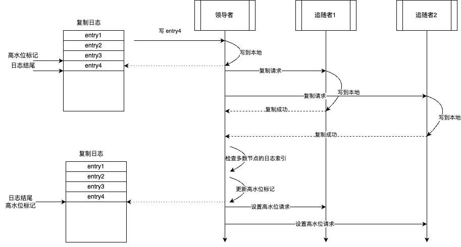
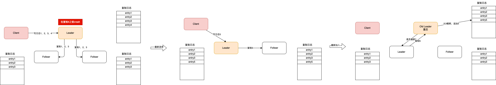

# High-Water Mark (高水位标记)

WAL（预写日志）中的一个索引（index），用来标记最后一次成功复制的日志序号。

又称：**提交索引**

## 问题

WAL 模式用于服务器崩溃、重启后恢复状态。但在服务器故障时，仅 WAL 是不够用的，没办法保证服务继续可用。  
如果单个服务器节点发生故障，那么在节点重启前，客户端都无法成功请求。为了提升系统的可用性，我们可以在
多个服务器节点上复制日志。通过领导者、追随者模式，领导者将其所有日志条目复制到多数（Quorum）追随者上。  
如果领导者故障了，那么可以选出新的领导者，新的领导者继续接处理请求，客户端可以像以前一样继续工作。

但这样仍然会出现一些问题：

- 领导者可能在日志发送给追随者之前就故障了；
- 领导者可能将日志发送给了一部分追随者，但未能成功同步给多数追随者。

在这些 case 下，部分追随者缺失一些日志，部分追随者可能比其它追随者有更多的日志。

**因此，每个追随者都必须需要知道哪些日志可以安全提供给客户端。**

::: tip
这里需要一点的专业背景，不适合初学者。
在分布式场景下，每个追随者节点都会处理客户端请求，但一般都是只读的，达到分担请求压力，提升吞吐量的作用。
但在客户端看来，多个追随者应该给出一致的请求结果，即对外表现仍然是一个节点。
上述的 case 中，多个追随者在日志上没有对齐，试想，如果日志内容刚好是 `Set A = 1`，此时节点 A 有，但节点 B 没有，那么
客户端读 A 和读 B 得到的结果是不一样的，即数据不一致。

这个时候就需要高水位标记了，部分追随者即使有多的日志，但所有追随者的有效日志索引是一致的，那对外的数据仍是一致的。
:::

## 解决方案

高水位标记是日志文件中的一个索引，记录了当前领导成功复制到多数追随者的最后一个日志条目。领导者在复制过程中，也会  
将高水位标记同步给追随者。集群中的所有节点，在处理客户端请求时，仅使用高水位以下的日志。

操作顺序如下：



每条日志，领导者追加到本地 WAL 后，然后将其发送到所有追随者。

```java{5}
// leader
class ReplicatedLog {
    private Long appendAndReplicate(byte[] data) {
        Long lastLogEntryIndex = appendToLocalLog(data);
        replicateOnFollowers(lastLogEntryIndex);
        return lastLogEntryIndex;
    }

    private void replicateOnFollowers(Long entryAtIndex) {
        for (final FollowerHandler follower : followers) {
            replicateOn(follower, entryAtIndex); // send replication requests to followers
        }
    }
}
```

追随者处理复制请求，并将日志追加到本地。成功追加日志后，追随者向领导者回复它们所拥有的最新日志条目索引。  
当然，回复中还包括了追随者当前的世代时钟（Generation Clock）。

```java
// follower
class ReplicatedLog {
    private ReplicationResponse appendEntries(ReplicationRequest replicationRequest) {
        List<WALEntry> entries = replicationRequest.getEntries();
        entries.stream()
                .filter(e -> !wal.exists(e))
                .forEach(e -> wal.writeEntry(e));
        return new ReplicationResponse(SUCCEEDED, serverId(), replicationState.getGeneration(), wal.getLastLogIndex());
    }
}
```

当收到响应时，领导者会更新在各个服务器上已复制的日志索引。

```java
class ReplicatedLog {
    logger.info("Updating matchIndex for " + response.getServerId() + " to " + response.getReplicatedLogIndex());
    updateMatchingLogIndex(response.getServerId(), response.getReplicatedLogIndex());
    var logIndexAtQuorum = computeHighwaterMark(logIndexesAtAllServers(), config.numberOfServers());
    var currentHighWaterMark = replicationState.getHighWaterMark();

    if (logIndexAtQuorum > currentHighWaterMark && logIndexAtQuorum != 0) {
        applyLogEntries(currentHighWaterMark, logIndexAtQuorum);
        replicationState.setHighWaterMark(logIndexAtQuorum);
    }
}
```

查看领导者以及所有追随者的日志索引，选取在大多数节点上都存在的索引来作为高水位标记。

```java
class ReplicatedLog {
    Long computeHighwaterMark(List<Long> serverLogIndexes, int noOfServers) {
        serverLogIndexes.sort(Long::compareTo);
        return serverLogIndexes.get(noOfServers / 2);
    }
}
```

::: info
在领导者选举过程中可能会出现一个棘手的问题。

我们必须确保在任何服务器节点向客户端发送数据之前，所有节点的高水位标记是一致的。

如果现有领导者在将高水位标记传播给所有追随者之前，就故障了，那么所有节点的高水位标记就无法保证不一致了。

Raft 算法在领导者选举成功后，向领导者的日志中追加一个 noop 日志来解决这一问题，
当所有追随者确认该条目后，才会为客户端提供服务。

在 ZAB（Zookeeper 原子广播协议）中，新领导者在开始为客户端提供服务之前，会先尝试将其所有日志推送给所有追随者。
:::

领导者会将高水位标记作为常规心跳的一部分或者通过单独的请求传播给追随者。

然后，追随者会相应地设置它们的高水位标记。

任何客户端只能读取到高水位标记之前的日志。高水位标记之后的日志对客户端来说是不可见的，因为无法确认这些日志是否已被复制，  
所以如果领导者出现故障，并且其他服务器被选举为领导者，那么这些条目可能就丢失了。

```java
class ReplicatedLog {
    public WALEntry readEntry(long index) {
        if (index > replicationState.getHighWaterMark()) {
            throw new IllegalArgumentException("Log entry not available");
        }

        return wal.readAt(index);
    }
}
```

## 日志清理

当一个服务器节点在崩溃，重启后重新加入集群，其日志可能与其它节点存在冲突。

因此，每当一个节点加入集群时，它都会与集群领导者进行核对，以了解日志中的哪些条目可能存在冲突。

然后，它会将日志截断到与领导者条目相匹配的位置，接着追加领导者后续日志，以确保其日志与集群其它节点相匹配。

考虑以下示例。客户端发送请求，要求添加四条日志。领导者成功复制了三个，但在将 4 添加到自己的日志后出现故障。
其中一个追随者被选举为新的领导者，并接收来自客户端更多的日志。当出现故障的那个领导者再次加入集群时，它有冲突的日志 4。
因此，它需要将自己的日志截断到 3，然后添加 5，以使自己的日志与集群其它节点相匹配。



任何重启或者新加入集群的节点，在短暂启动后，都会找到集群中的领导者。
然后，它会明确询问当前的高水位标记，将自己的日志截断至高水位标记处，再从领导者那里获取超出高水位标记的所有日志。
像 RAFT（ raft 一致性算法 ）这样的复制算法有相应的方法，通过将自身日志中的条目与请求中的日志条目进行核对来找出存在冲突的部分。
那些具有相同索引的日志，但世代时钟（Generation Clock）更低的日志会被移除。

```java
class ReplicatedLog {
    void maybeTruncate(ReplicationRequest replicationRequest) {
        replicationRequest.getEntries().stream()
            .filter(entry -> wal.getLastLogIndex() >= entry.getEntryIndex() &&
                    entry.getGeneration() != wal.readAt(entry.getEntryIndex()).getGeneration())
            .forEach(entry -> wal.truncate(entry.getEntryIndex()));
    }
}
```

一种支持日志截断的简单实现方式是维护一个日志索引与文件位置的映射表。然后就可以按照如下方式在给定的索引处截断日志：

```java
class WALSegment {
    public synchronized void truncate(Long logIndex) throws IOException {
        var filePosition = entryOffsets.get(logIndex);
        if (filePosition == null)
            throw new IllegalArgumentException("No file position available for logIndex=" + logIndex);

        fileChannel.truncate(filePosition);
        truncateIndex(logIndex);
    }

    private void truncateIndex(Long logIndex) {
        entryOffsets.entrySet().removeIf(entry -> entry.getKey() >= logIndex);
    }
}
```

## 例子

- 所有的一致性算法都使用高水位来确定何时应用客户端提议来触发状态变更。例如，在 [RAFT](https://raft.github.io/)一致性算法中，高水位标记被称作“提交索引（CommitIndex）”。

- [Kafka 复制协议](https://www.confluent.io/blog/hands-free-kafka-replication-a-lesson-in-operational-simplicity/)中，有一个单独维护的索引名为“高水位标记”。消费者只能看到高水位以下的消息。

- [Apache BookKeeper](https://bookkeeper.apache.org/)有“[最后确认添加](https://bookkeeper.apache.org/archives/docs/r4.4.0/bookkeeperProtocol.xhtml)”这个概念，它指的是已在多数节点（bookies）上成功复制的条目。
