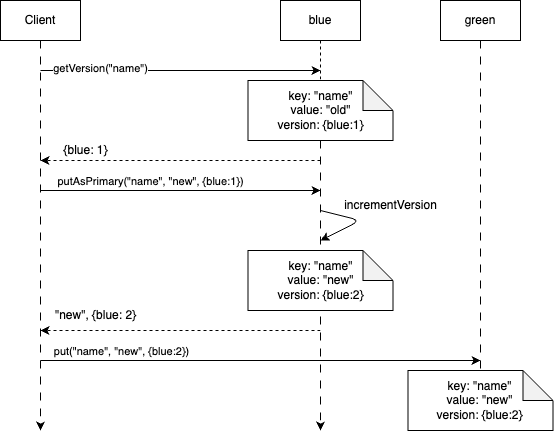
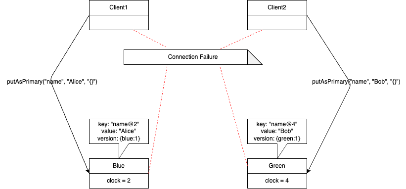
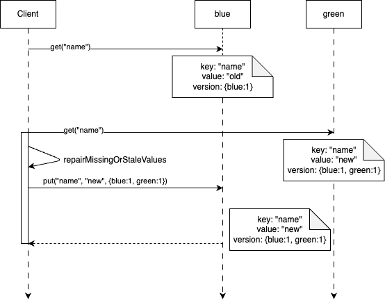
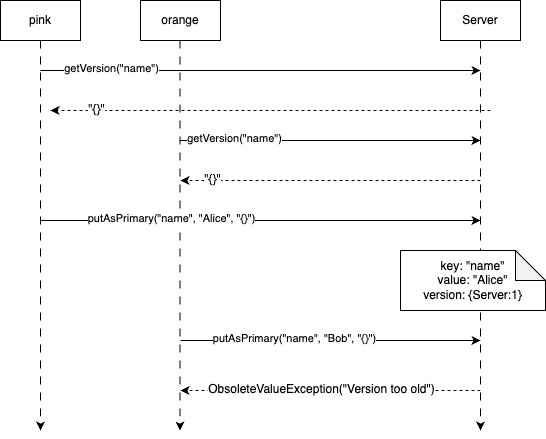
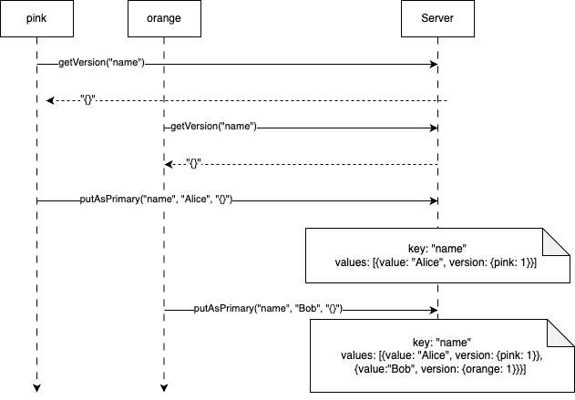

# Version Vector（版本向量）

维护一个版本列表，集群中的每个节点对应一个版本，以检测并发更新情况

## 问题

如果允许多个服务器节点对同一个键进行更新，那么检测多副本间的值何时被并发更新就很重要了。

## 解决方案

每个键值都与一个版本向量（[version vector](https://en.wikipedia.org/wiki/Version_vector)）相关联，该版本向量为集群中的每个节点都维护了一个版本号。

从本质上讲，版本向量就是一组计数器，集群中的每个节点都对应一个递增版本。

针对三个节点（蓝色节点、绿色节点、黑色节点），其版本向量看起来可能就像 [蓝色: 43，绿色: **54**，黑色: 12] 这样。  
每当一个节点进行内部更新时，它就会更新自己对应的版本，所以如果绿色节点进行了一次更新，  
那么该向量就会变为 [蓝色: 43，绿色: **55**，黑色: 12]。

每当两个节点进行通信时，它们就会同步各自的向量，从而能够检测到任何同时发生的并发更新。

::: info

### 与向量时钟的区别

[向量时钟](https://en.wikipedia.org/wiki/Vector_clock)的实现方式与之类似。  
但向量时钟用于追踪服务器上发生的每一个事件。相比之下，版本向量则用于检测一组副本中对同一个键的并发更新情况。

因此，版本向量的一个实例是按每个键来存储的，而不是按每个服务器来存储。  
像 [Riak](https://riak.com/posts/technical/vector-clocks-revisited/index.xhtml?p=9545.xhtml)这样的数据库在其[实现](https://riak.com/posts/technical/vector-clocks-revisited/index.xhtml?p=9545.xhtml)中使用 “版本向量” 一词，而非 “向量时钟”。

如需了解更多详细信息，请参阅 [版本向量并非向量时钟](https://haslab.wordpress.com/2011/07/08/version-vectors-are-not-vector-clocks/)。

:::

::: tip

版本向量与向量时钟确实有点饶，这里就它们的作用来简单区分：

- 向量时钟是为了在分布式环境下，建立事件之间的因果关系，即每个**操作**都关联了一个对应的时钟；
- 版本向量是为了检测分布式多节点并发更新，即每个节点都有一个版本，版本最后会落到具体的**值**上；

:::

一个典型的版本向量实现如下：

```java
class VersionVector {

    private final TreeMap<String, Long> versions;

    public VersionVector() {
        this(new TreeMap<>());
    }

    public VersionVector(TreeMap<String, Long> versions) {
        this.versions = versions;
    }

    public VersionVector increment(String nodeId) {
        TreeMap<String, Long> versions = new TreeMap<>();
        versions.putAll(this.versions);
        Long version = versions.get(nodeId);
        if (version == null) {
            version = 1L;
        } else {
            version = version + 1L;
        }
        versions.put(nodeId, version);
        return new VersionVector(versions);
    }
}
```

服务器节点上存储的每个值都有一个关联的版本向量：

```java
public class VersionedValue {
  String value;
  VersionVector versionVector;

  public VersionedValue(String value, VersionVector versionVector) {
    this.value = value;
    this.versionVector = versionVector;
  }

  @Override
  public boolean equals(Object o) {
    if (this == o) return true;
    if (o == null || getClass() != o.getClass()) return false;
    VersionedValue that = (VersionedValue) o;
    return Objects.equal(value, that.value) && Objects.equal(versionVector, that.versionVector);
  }

  @Override
  public int hashCode() {
    return Objects.hashCode(value, versionVector);
  }
}
```

## 版本向量比较

版本向量使用每个节点的版本号来进行比较。  
如果两个版本向量中，相同节点都有版本，且其中一个版本向量中的版本号都高于另一个版本向量的版本号，  
那么就认为这个版本向量高于另一个版本向量，反之亦然。

如果两个版本向量之间存在部分高，部分低，或者部分不存在，那么就认为它们是并发的。

以下是一些比较示例：

| 版本向量 1              | 比较关系 | 版本向量 2               |
| ----------------------- | -------- | ------------------------ |
| blue:2, green:1         | 大于     | blue:1, green:1          |
| blue:2, green:1         | 并发于   | blue:1, green:2          |
| blue:1, green:1, red: 1 | 大于     | blue:1, green:1          |
| blue:1, green:1, red: 1 | 并发于   | blue:1, green:1, pink: 1 |

比较实现如下：

```java
public enum Ordering {
  Before,
  After,
  Concurrent
}

class VersionVector {
  // This is exact code for Voldermort implementation of VectorClock comparison.
  // https://github.com/voldemort/voldemort/blob/master/src/java/voldemort/versioning/VectorClockUtils.java
  public static Ordering compare(VersionVector v1, VersionVector v2) {
    if(v1 == null || v2 == null)
      throw new IllegalArgumentException("Can’t compare null vector clocks!");
    // We do two checks: v1 <= v2 and v2 <= v1 if both are true then
    boolean v1Bigger = false;
    boolean v2Bigger = false;

    SortedSet<String> v1Nodes = v1.getVersions().navigableKeySet();
    SortedSet<String> v2Nodes = v2.getVersions().navigableKeySet();
    SortedSet<String> commonNodes = getCommonNodes(v1Nodes, v2Nodes);
    // if v1 has more nodes than common nodes
    // v1 has clocks that v2 does not
    if(v1Nodes.size() > commonNodes.size()) {
      v1Bigger = true;
    }
    // if v2 has more nodes than common nodes
    // v2 has clocks that v1 does not
    if(v2Nodes.size() > commonNodes.size()) {
      v2Bigger = true;
    }
    // compare the common parts
    for(String nodeId: commonNodes) {
      // no need to compare more
      if(v1Bigger && v2Bigger) {
          break;
      }
      long v1Version = v1.getVersions().get(nodeId);
      long v2Version = v2.getVersions().get(nodeId);
      if(v1Version > v2Version) {
          v1Bigger = true;
      } else if(v1Version < v2Version) {
        v2Bigger = true;
      }
    }

    /*
    * This is the case where they are equal. Consciously return BEFORE, so
    * that the we would throw back an ObsoleteVersionException for online
    * writes with the same clock.
    */
    if(!v1Bigger && !v2Bigger)
      return Ordering.Before;
      /* This is the case where v1 is a successor clock to v2 */
    else if(v1Bigger && !v2Bigger)
      return Ordering.After;
      /* This is the case where v2 is a successor clock to v1 */
    else if(!v1Bigger && v2Bigger)
      return Ordering.Before;
      /* This is the case where both clocks are parallel to one another */
    else
      return Ordering.Concurrent;
  }

  private static SortedSet<String> getCommonNodes(SortedSet<String> v1Nodes, SortedSet<String> v2Nodes) {
    // get clocks(nodeIds) that both v1 and v2 has
    SortedSet<String> commonNodes = Sets.newTreeSet(v1Nodes);
    commonNodes.retainAll(v2Nodes);
    return commonNodes;
  }

  public boolean descents(VersionVector other) {
    return other.compareTo(this) == Ordering.Before;
  }
}
```

## KV 存储中使用版本向量

版本向量可按如下方式用于 KV 存储。由于可能存在多个并发的值，所以需要一个带版本的值列表。

```java
public class VersionVectorKVStore {
  Map<String, List<VersionedValue>> kv = new HashMap<>();
}
```

当客户端想要存储一个值时，它首先需要读取值的最新版本。  
然后，客户端根据 key 来选择集群节点以存储。在存储时，客户端会携带已知版本。

请求流程如下图所示。有两台节点，分别名为蓝色（blue）和绿色（green）。对于 key**name**而言，blue 是主节点：



在无领导者复制方案中，客户端或协调节点根据 key 来选择写入数据的节点。版本向量会选择 key 所映射的（主）节点来更新。  
具有相同版本向量的值会被复制到其他集群节点。如果映射到 key 的集群节点不可用，则会选择下一个节点。

版本向量仅会在保存该值的第一个节点上递增。其他节点仅保存数据副本。

在[Voldemort](https://www.project-voldemort.com/voldemort/)之类的数据库中，用于递增版本向量的代码如下所示：

```java
class ClusterClient {
  public void put(String key, String value, VersionVector existingVersion) {
    List<Integer> allReplicas = findReplicas(key);
    int nodeIndex = 0;
    List<Exception> failures = new ArrayList<>();
    VersionedValue valueWrittenToPrimary = null;
    for (; nodeIndex < allReplicas.size(); nodeIndex++) {
      try {
        ClusterNode node = clusterNodes.get(nodeIndex);
        // the node which is the primary holder of the key value is responsible for incrementing version number.
        valueWrittenToPrimary = node.putAsPrimary(key, value, existingVersion);
        break;
      } catch (Exception e) {
        // if there is exception writing the value to the node, try other replica.
        failures.add(e);
      }
    }

    if (valueWrittenToPrimary == null) {
      throw new NotEnoughNodesAvailable("No node succeeded in writing the value.", failures);
    }

    // Succeded in writing the first node, copy the same to other nodes.
    nodeIndex++;
    for (; nodeIndex < allReplicas.size(); nodeIndex++) {
      ClusterNode node = clusterNodes.get(nodeIndex);
      node.put(key, valueWrittenToPrimary);
    }
  }
}
```

充当主节点的节点负责递增版本号。

```java
public VersionedValue putAsPrimary(String key, String value, VersionVector existingVersion) {
  VersionVector newVersion = existingVersion.increment(nodeId);
  VersionedValue versionedValue = new VersionedValue(value, newVersion);
  put(key, versionedValue);
  return versionedValue;
}

public void put(String key, VersionedValue value) {
  versionVectorKvStore.put(key, value);
}
```

从上述代码中可以看出，不同的客户端有可能在不同的节点上更新同一个键，例如当某个客户端无法连接到特定节点时就会出现这种情况。  
这就造成了一种局面：不同的节点拥有不同的值，而根据它们的版本向量来看，这些值是“并发”更新的。

如下图所示，客户端 1 和客户端 2 都试图对 key **name**进行写入操作。  
如果客户端 1 无法向 blue 写入数据，那么 green 就会缺失客户端 1 写入的值。  
当客户端 2 尝试写入，但无法连接到 blue 时，它就会在 green 上进行写入。  
key **name**的版本向量将反映出 blue 和 green 存在并发写入的情况。



因此，基于版本向量的存储方式会为任何 key 保留多个版本，这些版本被视为并发冲突。

```java
class VersionVectorKVStore {
  public void put(String key, VersionedValue newValue) {
    List<VersionedValue> existingValues = kv.get(key);
    if (existingValues == null) {
      existingValues = new ArrayList<>();
    }

    rejectIfOldWrite(key, newValue, existingValues);
    List<VersionedValue> newValues = merge(newValue, existingValues);
    kv.put(key, newValues);
  }

  // If the newValue is older than existing one reject it.
  private void rejectIfOldWrite(String key, VersionedValue newValue, List<VersionedValue> existingValues) {
    for (VersionedValue existingValue : existingValues) {
      if (existingValue.descendsVersion(newValue)) {
          throw new ObsoleteVersionException("Obsolete version for key ‘" + key
              + "’: " + newValue.versionVector);
      }
    }
  }
  // Merge new value with existing values. Remove values with lower version than the newValue.
  // If the old value is neither before or after (concurrent) with the newValue. It will be preserved
  private List<VersionedValue> merge(VersionedValue newValue, List<VersionedValue> existingValues) {
    List<VersionedValue> retainedValues = removeOlderVersions(newValue, existingValues);
    retainedValues.add(newValue);
    return retainedValues;
  }

  private List<VersionedValue> removeOlderVersions(VersionedValue newValue, List<VersionedValue> existingValues) {
    List<VersionedValue> retainedValues = existingValues
        .stream()
        .filter(v -> !newValue.descendsVersion(v)) // keep versions which are not directly dominated by newValue.
        .collect(Collectors.toList());
    return retainedValues;
  }
}
```

如果在从多个节点读取数据时检测到并发冲突，就会抛出一个错误，以便客户端能够进行冲突解决。

## 解决冲突

如果从不同副本返回了多个版本值，通过比较版本向量能够检测出最新值。

```java
class ClusterClient {
  public List<VersionedValue> get(String key) {
    List<Integer> allReplicas = findReplicas(key);

    List<VersionedValue> allValues = new ArrayList<>();
    for (Integer index : allReplicas) {
      ClusterNode clusterNode = clusterNodes.get(index);
      List<VersionedValue> nodeVersions = clusterNode.get(key);

      allValues.addAll(nodeVersions);
    }

    return latestValuesAcrossReplicas(allValues);
  }
  private List<VersionedValue> latestValuesAcrossReplicas(List<VersionedValue> allValues) {
    List<VersionedValue> uniqueValues = removeDuplicates(allValues);
    return retainOnlyLatestValues(uniqueValues);
  }

  private List<VersionedValue> retainOnlyLatestValues(List<VersionedValue> versionedValues) {
    for (int i = 0; i < versionedValues.size(); i++) {
      VersionedValue v1 = versionedValues.get(i);
      versionedValues.removeAll(getPredecessors(v1, versionedValues));
    }
    return versionedValues;
  }
  private List<VersionedValue> getPredecessors(VersionedValue v1, List<VersionedValue> versionedValues) {
    List<VersionedValue> predecessors = new ArrayList<>();
    for (VersionedValue v2 : versionedValues) {
      if (!v1.sameVersion(v2) && v1.descendsVersion(v2)) {
        predecessors.add(v2);
      }
    }
    return predecessors;
  }

  private List<VersionedValue> removeDuplicates(List<VersionedValue> allValues) {
    return allValues.stream().distinct().collect(Collectors.toList());
  }
}
```

当存在并发更新情况时，仅仅基于版本向量来解决冲突是不够的。  
因此，客户端提供应用程序的冲突解决器就很重要了。客户端在读取某个值时可以提供一个冲突解决器。

```java
public interface ConflictResolver {
  VersionedValue resolve(List<VersionedValue> values);
}

class ClusterClient {
  public VersionedValue getResolvedValue(String key, ConflictResolver resolver) {
    List<VersionedValue> versionedValues = get(key);
    return resolver.resolve(versionedValues);
  }
}
```

例如，[riak](https://riak.com/posts/technical/vector-clocks-revisited/index.xhtml?p=9545.xhtml)允许应用程序自行提供[冲突解决器]()。

## 最后写入者胜（LWW）冲突解决方法

::: info

### Cassandra 与 LWW

[Cassandra](http://cassandra.apache.org/)虽然在架构上与[Riak](https://riak.com/posts/technical/vector-clocks-revisited/index.xhtml?p=9545.xhtml)或[Voldemort](https://www.project-voldemort.com/voldemort/)相同，但它根本不使用版本向量，且仅支持 LWW 这一冲突解决策略。

Cassandra 是一个列族数据库，而非简单的键值存储，它为每一列都存储时间戳，而不是针对整个值来存储时间戳。  
虽然这免去了用户进行冲突解决的负担，但用户需要确保[网络时间协议（NTP）](https://en.wikipedia.org/wiki/Network_Time_Protocol)服务在 Cassandra 各个节点上都已正确配置并能正常运行。在最坏的情况下，由于时钟漂移，一些最新的值可能会被较旧的值覆盖。

:::

虽然版本向量能够检测不同服务器节点间的并发写入情况，但在出现冲突时，它们本身并不能帮助客户端确定该选择哪个值。  
解决冲突的责任落在了客户端身上。有时客户端更倾向于让键值存储基于时间戳来进行冲突解决。  
尽管跨服务器的时间戳存在已知问题，但这种方法简单，成为客户端的首选，即便它存在因跨服务器时间戳问题而丢失部分更新的风险。  
他们非常依赖网络时间协议（NTP）服务在整个集群中得到良好配置并正常运行。

像[Riak](https://www.project-voldemort.com/voldemort/)和[Voldemort](https://www.project-voldemort.com/voldemort/)这样的数据库允许用户选择 LWW 这一冲突解决策略。

为支持 LWW 冲突解决策略，在写入每个值时会同时存储一个时间戳。

```java
class TimestampedVersionedValue {
  String value;
  VersionVector versionVector;
  long timestamp;

  public TimestampedVersionedValue(String value, VersionVector versionVector, long timestamp) {
    this.value = value;
    this.versionVector = versionVector;
    this.timestamp = timestamp;
  }
}
```

当客户端读取时，可以使用时间戳去选择最后的值。在这种情况下，版本向量完全被忽略了。

```java
public Optional<TimestampedVersionedValue> getWithLWWW(List<TimestampedVersionedValue> values) {
  return values.stream().max(Comparator.comparingLong(v -> v.timestamp));
}
```

## 读修复

允许任何节点接受写入请求虽然可以提高服务可用性，但最终确保所有副本都拥有相同数据也很重要。  
副本修复的常见方法之一是在客户端读取数据时进行操作。

在解决冲突时，也有可能检测出哪些节点有旧版本数据。  
在处理客户端的读取请求时，可以将最新版本发送给那些拥有旧版本的节点，这被称为**读修复**。

考虑如下图所示的场景。blue 和 green 两个节点都存有 key **name**的值。  
blue 节点拥有最新版本，其版本向量为[blue: 1，green: 1]。  
当从 blue 和 green 这两个副本中读取这些值时，会对它们进行比较，以找出哪个节点缺少最新版本，  
然后将新版本数据通过写入（put）请求发送给对应的集群节点。



## 允许在同一节点上进行并发更新

存在两个客户端同时向一个节点进行写入的可能性。在上述的默认实现中，第二次写入操作将会被拒绝。  
在这种情况下，仅为每个集群节点设置版本号的基本实现是不够的。

考虑以下场景：

当有两个客户端试图更新同一个 key 时，第二个客户端将会收到一个异常，因为它在写入（put）请求中传入的版本已经过时了。



像[Riak](https://riak.com/posts/technical/vector-clocks-revisited/index.xhtml?p=9545.xhtml)这样的数据库，客户端更加灵活，允许这类并发写入情况存在，并且更倾向于不返回错误。

## 使用客户端 ID 而非服务端 ID

如果每个客户端都能有一个唯一 ID，那么就可以使用客户端 ID。  
每个客户端 ID 都会对应存储一个版本号。每当客户端写入一个值时，它首先会读取现有的版本，然后将与该客户端 ID 相关联的数字递增，并将其写入服务器。

```java
class ClusterClient {
  private VersionedValue putWithClientId(String clientId, int nodeIndex,
      String key, String value, VersionVector version) {
    ClusterNode node = clusterNodes.get(nodeIndex);
    VersionVector newVersion = version.increment(clientId);
    VersionedValue versionedValue = new VersionedValue(value, newVersion);
    node.put(key, versionedValue);
    return versionedValue;
  }
}
```

因为每个客户端都会递增其自身对应的版本，所以并发写入操作会在服务器上创建兄弟值（并存的值），因此并发写入操作永远不会失败。

上述那种会向第二个客户端返回错误的场景，但这次不会，其运作方式如下：



## 点式版本向量（向量时钟）

基于客户端标识的版本向量存在的一个主要问题是，版本向量的大小直接取决于客户端的数量。  
随着时间推移，这会导致某个 key 积累过多的并发值。  
这个问题被称为[兄弟值爆炸](https://docs.riak.com/riak/kv/2.2.3/learn/concepts/causal-context/index.xhtml#sibling-explosion)。

为解决这一问题，同时仍然允许基于集群节点的版本向量存在，[Riak](https://riak.com/posts/technical/vector-clocks-revisited/index.xhtml?p=9545.xhtml)使用了一种名为[点式版本向量](https://riak.com/posts/technical/vector-clocks-revisited-part-2-dotted-version-vectors/index.xhtml)的版本向量变体。

## 示例

[Voldemort](https://www.project-voldemort.com/voldemort/) 按照此方案来使用版本向量。它允许基于时间戳的“最后写入者胜”冲突解决方法。

[Riak](https://riak.com/posts/technical/vector-clocks-revisited/index.xhtml?p=9545.xhtml) 起初使用基于客户端 ID 的版本向量，后来改为基于服务器 ID 的版本向量，最终采用了点式版本向量。  
Riak 还支持基于系统时间戳的 LWW 冲突解决方法。

[Cassandra](http://cassandra.apache.org/)不使用版本向量，它仅支持基于系统时间戳的 LWW 冲突解决方法。
