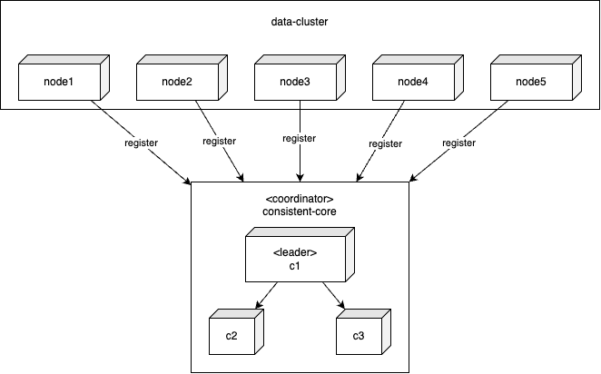
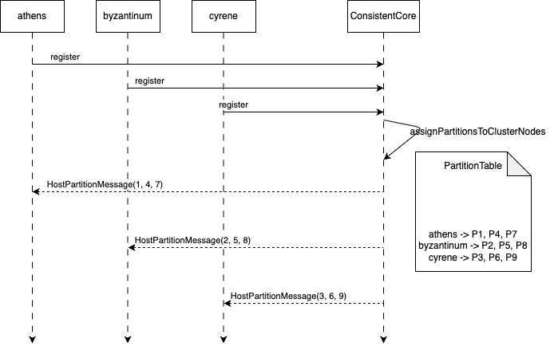
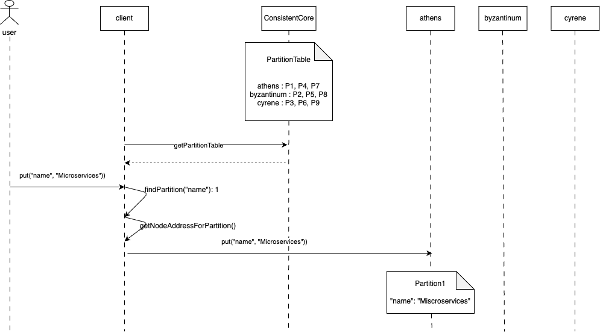
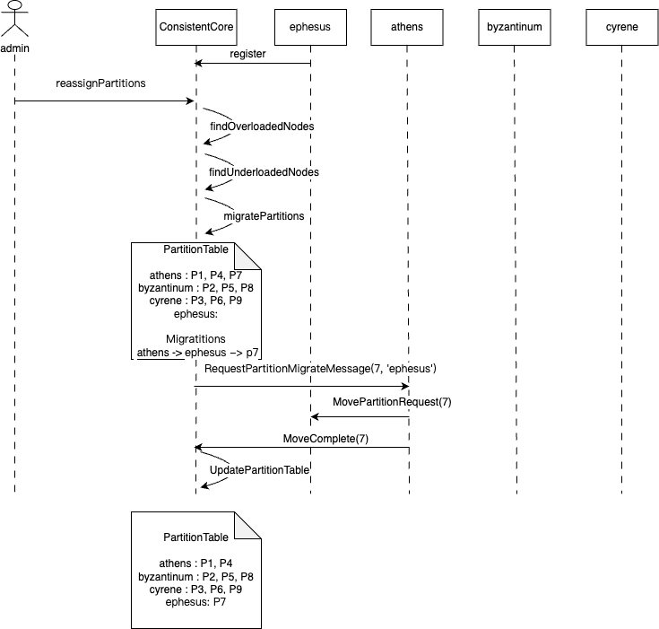
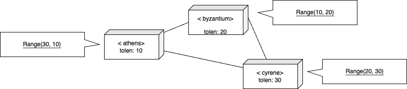
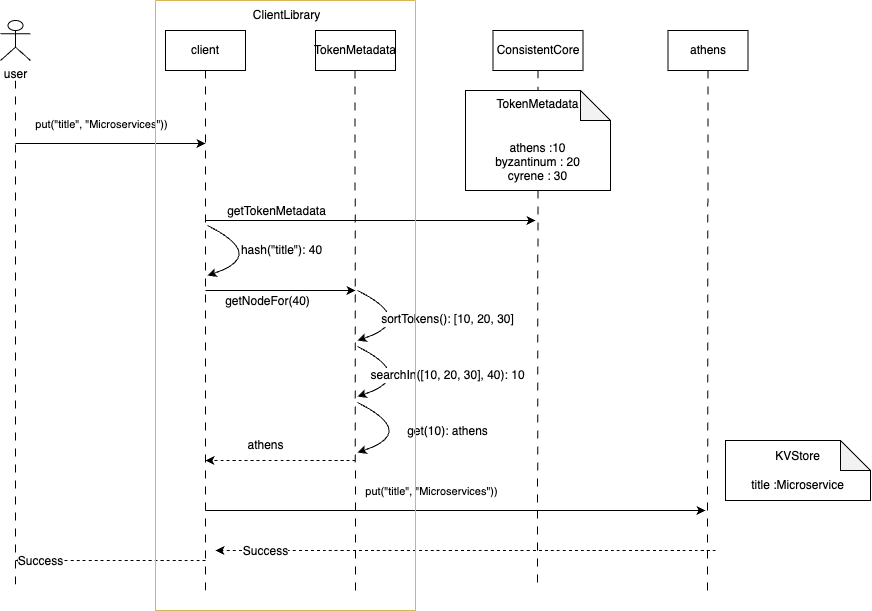
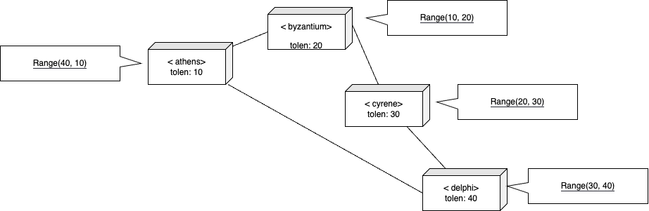
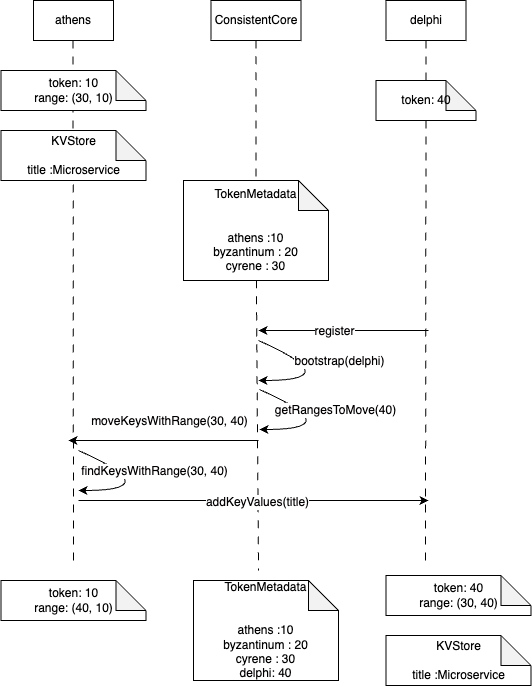
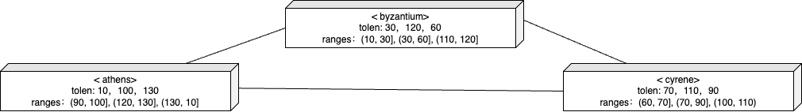
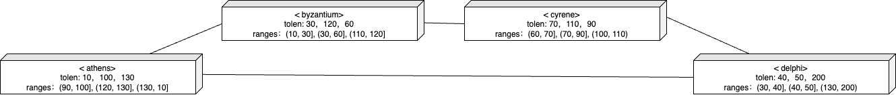

# 固定分区（Fixed Partitions）

分区数量固定不变，即使集群规模发生变化，数据到分区的映射依然保持不变。

## 问题

在一组节点间拆分数据，需要将每项都映射到这些节点上。要将数据映射到节点上有两项要求：

- 分布应当均匀。

- 能够感知具体一个节点存储了哪些数据，而无需向所有节点发起请求。

以 KV 存储为例，使用 key 的哈希取模后，将其映射到集群一个节点上，这样就能满足上述两项要求。

因此，我们设想一个由三节点构成的集群，就可以按如下方式对 Alice, Bob, Mary 和 Philip 这些 kye 进行映射：

| Keys   | Hash                                    | Node Index(Hash % 3) |
| ------ | --------------------------------------- | -------------------- |
| Alice  | 133299819613694460644190938031451912208 | 2                    |
| Bob    | 63479738429015246738359000453022047291  | 1                    |
| Mary   | 37724856304035789372490271084843241126  | 2                    |
| Philip | 83980963731216160506671296398339418866  | 2                    |

然而，当集群规模发生变化时，这种方法会产生一个问题。如果给集群再增加两个节点，我们就会有五个节点。那时映射情况将如下所示：

| Keys   | Hash                                    | Node Index(Hash % 5) |
| ------ | --------------------------------------- | -------------------- |
| Alice  | 133299819613694460644190938031451912208 | 3                    |
| Bob    | 63479738429015246738359000453022047291  | 1                    |
| Mary   | 37724856304035789372490271084843241126  | 1                    |
| Philip | 83980963731216160506671296398339418866  | 1                    |

几乎所有 key 的映射都改变了。即使只添加少量新节点，所有数据都需要被移动。当数据量很大时，这是不可取的。

## 解决方案

::: tip
消息中间件，比如[Kafka]()需要保证每个分区中有序。

使用固定分区时，即使向集群添加新节点，导致分区重新分配，每个分区数据也不会改变。  
这样每个分区数据的顺序仍然不变。
:::

最常用的解决方案是将数据映射到逻辑分区。  
逻辑分区会被映射到集群节点上。即便集群节点有所增减，数据到分区的映射也不会改变。

集群启动时会预先配置一定数量的分区，例如，1024 个分区。向集群中添加新节点时，这个数量不会改变。  
因此，利用 key 哈希将数据映射到分区的方式保持不变。

重要的是，分区在集群节点间均匀分布。当分区迁移到新节点时，数据迁移量应该相对较小，且过程要比较迅速。  
一旦配置完成，分区编号就不会改变；这意味着它应当为未来数据增长预留足够空间。

所以，分区数量应当远远多于集群节点的数量。

例如，[Akka]()建议分片数量应当是节点数量的十倍。[Apache Ignite]()中的分区数默认值为 1024。  
如果集群规模小于 100，[Hazelcast]()）的默认值为 271。

数据的存储或查询分为两步：

1. 找到 key 对应的分区。

2. 找到存储该分区的集群节点。

当添加新节点时，为了平衡集群数据，可以将部分分区迁移到新节点上。

## 选择哈希函数

选择一种无论在何种平台和运行时环境下都能生成相同哈希值的哈希方法至关重要。

例如，Java 会为每个对象提供一个哈希值。

然而，哈希值取决于 JVM。因此，两个不同的 JVM 可能会为同一个键生成不同的哈希值。  
为解决这一问题，人们会使用 MD5 或 Murmur 之类的哈希算法。

```java
class HashingUtil {
    public static BigInteger hash(String key)
    {
        try
        {
            MessageDigest messageDigest = MessageDigest.getInstance("MD5");
            return new BigInteger(messageDigest.digest(key.getBytes()));
        }
        catch (Exception e)
        {
            throw new RuntimeException(e);
        }
    }
}
```

key 并非映射到节点，而是映射到分区。  
假设存在 9 个分区，如下所示。当集群添加新节点时，key 到分区的映射不会改变。

| Keys   | Hash                                    | Partition (Hash % Node 9) |
| ------ | --------------------------------------- | ------------------------- |
| Alice  | 133299819613694460644197938031451902208 |                           |
| Bob    | 63479738429015246138359000453022042291  |                           |
| Mary   | 37724856304035789372490171084843241126  |                           |
| Philip | 83980963731216160806671196398339418866  |                           |

## 分区、节点映射

分区需要映射到节点上。映射关系也需要存储，并让客户端可访问。  
通常会使用一致性核心服务来处理。这个专门的一致性核心服务充当协调器的角色，它会跟踪集群中的所有节点，并将分区映射到节点上。  
它还会使用日志来存储这种映射关系以提升容错。

[YugabyteDB()]中的 master 节点或者 Kafka 中[控制器](参考文献：bib-kip-631)都是很好的例子。

[Akka](参考文献：bib-akka)或 [Hazelcast](参考文献：bib-hazelcast)这类 p2p 系统也需要特定的集群节点来充当协调器。  
它们采用临时领导者（Emergent Leader）作为协调器。

[Kubernetes](（参考文献：bib-kubernetes）)使用一致性核心服务，比如 [etcd](（参考文献：bib-etcd）)。  
它们需要从集群节点中选出一个节点来充当协调器角色。[leaderfollower.xhtml#LeaderElectionUsingExternallinearizableStore]

## 记录集群成员状态



每个节点都会在一致性核心中注册自己。它会周期性发送心跳请求，以便一致性核心检测节点故障。

```java
class KVStore {
    public void start() {
        socketListener.start();
        requestHandler.start();
        network.sendAndReceive(coordLeader, new RegisterClusterNodeRequest(generateMessageId(), listenAddress));
        scheduler.scheduleAtFixedRate(()->{
            network.send(coordLeader, new HeartbeatMessage(generateMessageId(), listenAddress));
        }, 200, 200, TimeUnit.MILLISECONDS);
    }
}
```

协调者处理注册请求，然后存储成员信息。

```java
class ClusterCoordinator {
    ReplicatedLog replicatedLog;
    Membership membership = new Membership();
    TimeoutBasedFailureDetector failureDetector = new TimeoutBasedFailureDetector(Duration.ofMillis(TIMEOUT_MILLIS));

    private void handleRegisterClusterNodeRequest(Message message) {
        logger.info("Registering node " + message.from);
        CompletableFuture completableFuture = registerClusterNode(message.from);
        completableFuture.whenComplete((response, error) -> {
            logger.info("Sending register response to node " + message.from);
            network.send(message.from, new RegisterClusterNodeResponse(message.messageId, listenAddress));
        });
    }

    public CompletableFuture registerClusterNode(InetAddressAndPort address) {
        return replicatedLog.propose(new RegisterClusterNodeCommand(address));
    }
}
```

当注册请求被提交到复制日志后，成员状态会被更新。

```java
class ClusterCoordinator {
    private void applyRegisterClusterNodeEntry(RegisterClusterNodeCommand command) {
        updateMembership(command.memberAddress);
    }

    private void updateMembership(InetAddressAndPort address) {
        membership = membership.addNewMember(address);
        failureDetector.heartBeatReceived(address);
    }
}
```

协调器需要维护集群的所有节点的状态。

```java
public class Membership {
  List<Member> liveMembers = new ArrayList<>();
  List<Member> failedMembers = new ArrayList<>();

  public boolean isFailed(InetAddressAndPort address) {
    return failedMembers.stream().anyMatch(m -> m.address.equals(address));
  }
}

class Member{
    public class Member implements Comparable<Member> {
        InetAddressAndPort address;
        MemberStatus status;
    }
}
```

协调器使用租约机制来检测集群节点故障。如果某个节点停止发送心跳信号，该节点就会被标记为**故障**。

```java
class ClusterCoordinator {
    @Override
    public void onBecomingLeader() {
        scheduledTask = executor.scheduleWithFixedDelay(this::checkMembership,
            1000,
            1000,
            TimeUnit.MILLISECONDS);
        failureDetector.start();
    }

    private void checkMembership() {
        List<Member> failedMembers = getFailedMembers();
        if (!failedMembers.isEmpty()) {
            replicatedLog.propose(new MemberFailedCommand(failedMembers));
        }
    }

    private List<Member> getFailedMembers() {
        List<Member> liveMembers = membership.getLiveMembers();
        return liveMembers.stream()
            .filter(m -> failureDetector.isMonitoring(m.getAddress()) && !failureDetector.isAlive(m.getAddress()))
            .collect(Collectors.toList());
    }
}
```

## 例子

假设有三个节点，分别是 athens、byzantium 和 cyrene，并存在 9 个分区，流程如下所示。



客户端可通过分区表，映射数据 key 到具体的节点上。



现在，一个新节点——ephesus 被添加到了集群中。管理员触发了重新分配操作，协调器通过检查分区表来查看哪些节点负载不足。

它发现 ephesus 节点负载不足，于是决定将分区 7 分配给它，把该分区从 athens 节点迁移过来。

协调器先存储迁移信息，然后向 athens 节点发送，迁移分区 7 到 ephesus 的请求。  
一旦迁移完成，athens 节点会通知协调器。随后，协调器会更新分区表。



## 分配分区给节点

:::tip
对于[Kafka](（参考文献：bib-kafka）)或 [Hazelcast](（参考文献：bib-hazelcast）)这类拥有主题、缓存或数据表等逻辑存储结构的数据存储系统而言，分区是与数据表、主题或缓存同时创建的。  
预期情况是，这些存储结构会在节点启动后，并已向一致性核心服务完成注册之后再创建。
:::

协调器会将分区分配给当时已知节点。如果每次添加新节点时，都触发分配操作，在集群达到稳定状态之前，分区映射会非常频繁。  
这就是为什么应该对协调器进行配置，使其要等到集群达到最小规模后再执行操作的原因。

首次进行分区分配时，可以简单地采用轮询的方式来完成。[Ignite](（参考文献：bib-ignite）)则使用了一种更为复杂的映射方式，即[一致性哈希（rendezvous_hashing）](（参考文献：bib-rendezvous_hashing）)。

```java
class ClusterCoordinator {
    CompletableFuture assignPartitionsToClusterNodes() {
        if (!minimumClusterSizeReached()) {
            return CompletableFuture.failedFuture(new NotEnoughClusterNodesException(MINIMUM_CLUSTER_SIZE));
        }
        return initializePartitionAssignment();
    }

    private boolean minimumClusterSizeReached() {
        return membership.getLiveMembers().size() >= MINIMUM_CLUSTER_SIZE;
    }

    private CompletableFuture initializePartitionAssignment() {
        partitionAssignmentStatus = PartitionAssignmentStatus.IN_PROGRESS;
        PartitionTable partitionTable = arrangePartitions();
        return replicatedLog.propose(new PartitiontableCommand(partitionTable));
    }

    public PartitionTable arrangePartitions() {
        PartitionTable partitionTable = new PartitionTable();
        List<Member> liveMembers = membership.getLiveMembers();
        for (int partitionId = 1; partitionId <= noOfPartitions; partitionId++) {
            int index = partitionId % liveMembers.size();
            Member member = liveMembers.get(index);
            partitionTable.addPartition(partitionId, new PartitionInfo(partitionId, member.getAddress(), PartitionStatus.ASSIGNED));
        }
        return partitionTable;
    }
}
```

复制日志负责将分区表持久化。

```java
class ClusterCoordinator {
    PartitionTable partitionTable;
    PartitionAssignmentStatus partitionAssignmentStatus = PartitionAssignmentStatus.UNASSIGNED;

    private void applyPartitionTableCommand(PartitiontableCommand command) {
        this.partitionTable = command.partitionTable;
        partitionAssignmentStatus = PartitionAssignmentStatus.ASSIGNED;
        if (isLeader()) {
            sendMessagesToMembers(partitionTable);
        }
    }
}
```

一旦分区分配情况被持久化，协调器就会向所有集群节点发送消息，告知各个节点其现在所拥有的分区。

```java
class ClusterCoordinator {
    List<Integer> pendingPartitionAssignments = new ArrayList<>();
    private void sendMessagesToMembers(PartitionTable partitionTable) {
        Map<Integer, PartitionInfo> partitionsTobeHosted = partitionTable.getPartitionsTobeHosted();
        partitionsTobeHosted.forEach((partitionId, partitionInfo) -> {
            pendingPartitionAssignments.add(partitionId);
            HostPartitionMessage message = new HostPartitionMessage(requestNumber++, this.listenAddress, partitionId);
            logger.info("Sending host partition message to " + partitionInfo.hostedOn + " partitionId=" + partitionId);
            scheduler.execute(new RetryableTask(partitionInfo.hostedOn, network, this, partitionId, message));
        });
    }
}
```

控制器会持续不断地尝试与各个节点取得联系，直至其消息发送成功为止。

```java
static class RetryableTask implements Runnable {
  Logger logger = LogManager.getLogger(RetryableTask.class);
  InetAddressAndPort address;
  Network network;
  ClusterCoordinator coordinator;
  Integer partitionId;
  int attempt;
  private Message message;

  public RetryableTask(InetAddressAndPort address, Network network, ClusterCoordinator coordinator, Integer partitionId, Message message) {
    this.address = address;
    this.network = network;
    this.coordinator = coordinator;
    this.partitionId = partitionId;
    this.message = message;
  }

  @Override
  public void run() {
    attempt++;
    try {
       //stop trying if the node is failed.
       if (coordinator.isSuspected(address)) {
          return;
       }
       logger.info("Sending " + message + " to=" + address);
       network.send(address, message);
    } catch (Exception e) {
       logger.error("Error trying to send ");
       scheduleWithBackOff();
    }
  }

  private void scheduleWithBackOff() {
    scheduler.schedule(this, getBackOffDelay(attempt), TimeUnit.MILLISECONDS);
  }

  private long getBackOffDelay(int attempt) {
    long baseDelay = (long) Math.pow(2, attempt);
    long jitter = randomJitter();
    return baseDelay + jitter;
  }

  private long randomJitter() {
    int i = new Random(1).nextInt();
    i = i < 0 ? i * -1 : i;
    long jitter = i % 50;
    return jitter;
  }
}
```

当集群节点收到创建分区的请求时，它会使用给定的分区编号创建一个分区。

如果在一个简单的 KV 存储系统中，其实现方式大概如下：

```java
class KVStore{
    Map<Integer, Partition> allPartitions = new ConcurrentHashMap<>();
    private void handleHostPartitionMessage(Message message) {
        Integer partitionId = ((HostPartitionMessage) message).getPartitionId();
        addPartitions(partitionId);
        logger.info("Adding partition " + partitionId + " to " + listenAddress);
        network.send(message.from, new HostPartitionAcks(message.messageId, this.listenAddress, partitionId));
    }

    public void addPartitions(Integer partitionId) {
        allPartitions.put(partitionId, new Partition(partitionId));
    }
}

class Partition {
    SortedMap<String, String> kv = new TreeMap<>();
    private Integer partitionId;
}
```

一旦协调器收到分区已成功创建的消息，它就会将该信息持久化存储到复制日志中，并将分区状态更新为**在线**。

```java
class ClusterCoordinator {
    private void handleHostPartitionAck(Message message) {
        int partitionId = ((HostPartitionAcks) message).getPartitionId();
        pendingPartitionAssignments.remove(Integer.valueOf(partitionId));
        logger.info("Received host partition ack from " + message.from + " partitionId=" + partitionId + " pending=" + pendingPartitionAssignments);
        CompletableFuture future = replicatedLog.propose(new UpdatePartitionStatusCommand(partitionId, PartitionStatus.ONLINE));
        future.join();
    }
}
```

一旦分区复制位点到达高水位，并且记录都已被应用，分区状态就会更新。

```java
class ClusterCoordinator {
    private void updateParitionStatus(UpdatePartitionStatusCommand command) {
        removePendingRequest(command.partitionId);
        logger.info("Changing status for " + command.partitionId + " to " + command.status);
        logger.info(partitionTable.toString());
        partitionTable.updateStatus(command.partitionId, command.status);
    }
}
```

## 客户端接口

如果我们再次以一个简单的 KV 存储为例，倘若客户端需要存储某个 key 的值或者获取该 key 对应的值，可按以下步骤进行操作：

1. 客户端取得 key 对应的哈希，并依据分区总数找到相关分区；

2. 客户端从协调器获取分区表，然后找出承载该分区的集群节点。客户端还会定期刷新分区表。

:::tip
[Kafka](（参考文献：bib-kafka）)曾遇到一个[问题](（参考文献：bib-kafka-metadata-issue）)，即所有的生产者/消费者都从 [Zookeeper](（参考文献：bib-zookeeper）)获取分区元数据，后来它决定让 broker 能提供元数据。

在 [YugabyteDB](参考文献：bib-yugabyte)中也出现过类似的[问题](（参考文献：bib-yb-metadata-issue）)。
:::

客户端从协调器获取分区表的做法很容易造成瓶颈，尤其是所有请求都由单一的协调器领导者来处理时更是如此。  
这就是为什么通常的做法是让所有集群节点都能提供元数据的原因。协调器既可以将元数据推送至集群节点，集群节点也可以从协调器拉取元数据。这样一来，客户端就可以连接任何集群节点来刷新元数据了。

通常 KV 存储的客户端库内部实现了该逻辑，或者通过集群节点来处理实现。

```java
class Client {
    public void put(String key, String value) throws IOException {
        Integer partitionId = findPartition(key, noOfPartitions);
        InetAddressAndPort nodeAddress = getNodeAddressFor(partitionId);
        sendPutMessage(partitionId, nodeAddress, key, value);
    }

    private InetAddressAndPort getNodeAddressFor(Integer partitionId) {
        PartitionInfo partitionInfo = partitionTable.getPartition(partitionId);
        InetAddressAndPort nodeAddress = partitionInfo.getAddress();
        return nodeAddress;
    }

    private void sendPutMessage(Integer partitionId, InetAddressAndPort address, String key, String value) throws IOException {
        PartitionPutMessage partitionPutMessage = new PartitionPutMessage(partitionId, key, value);
        SocketClient socketClient = new SocketClient(address);
        socketClient.blockingSend(new RequestOrResponse(RequestId.PartitionPutKV.getId(),
                                JsonSerDes.serialize(partitionPutMessage)));
    }

    public String get(String key) throws IOException {
        Integer partitionId = findPartition(key, noOfPartitions);
        InetAddressAndPort nodeAddress = getNodeAddressFor(partitionId);
        return sendGetMessage(partitionId, key, nodeAddress);
    }

    private String sendGetMessage(Integer partitionId, String key, InetAddressAndPort address) throws IOException {
        PartitionGetMessage partitionGetMessage = new PartitionGetMessage(partitionId, key);
        SocketClient socketClient = new SocketClient(address);
        RequestOrResponse response = socketClient.blockingSend(new RequestOrResponse(RequestId.PartitionGetKV.getId(), JsonSerDes.serialize(partitionGetMessage)));
        PartitionGetResponseMessage partitionGetResponseMessage = JsonSerDes.deserialize(response.getMessageBodyJson(), PartitionGetResponseMessage.class);
        return partitionGetResponseMessage.getValue();
    }
}
```

## 分区迁移至新节点

当向集群中添加新节点时，部分分区可以迁移至其他节点。  
在添加新的集群节点后，这一操作可自动完成。但这可能涉及在集群节点间迁移大量数据，正因如此，管理员通常会触发重新分区操作。

一种简单的操作方法是，先计算出每个节点应承载的平均分区数量，然后将多余的分区迁移至新节点。  
例如，如果分区数量为 30 个，且集群中现有 3 个节点，那么每个节点应承载 10 个分区。  
如果添加一个新节点，那么平均到每个节点大约是 7 个分区。因此，协调器会尝试从每个集群节点向新节点迁移 3 个分区。

```java
class ClusterCoordinator{

List<Migration> pendingMigrations = new ArrayList<>();

boolean reassignPartitions() {
  if (partitionAssignmentInProgress()) {
     logger.info("Partition assignment in progress");
     return false;
  }
  List<Migration> migrations = repartition(this.partitionTable);
  CompletableFuture proposalFuture = replicatedLog.propose(new MigratePartitionsCommand(migrations));
  proposalFuture.join();
  return true;
}

public List<Migration> repartition(PartitionTable partitionTable) {
  int averagePartitionsPerNode = getAveragePartitionsPerNode();
  List<Member> liveMembers = membership.getLiveMembers();
  var overloadedNodes = partitionTable.getOverloadedNodes(averagePartitionsPerNode, liveMembers);
  var underloadedNodes = partitionTable.getUnderloadedNodes(averagePartitionsPerNode, liveMembers);

  var migrations = tryMovingPartitionsToUnderLoadedMembers(averagePartitionsPerNode, overloadedNodes, underloadedNodes);
  return migrations;
}
private List<Migration> tryMovingPartitionsToUnderLoadedMembers(int averagePartitionsPerNode,
                                            Map<InetAddressAndPort, PartitionList> overloadedNodes,
                                            Map<InetAddressAndPort, PartitionList> underloadedNodes) {
  List<Migration> migrations = new ArrayList<>();
  for (InetAddressAndPort member : overloadedNodes.keySet()) {
    var partitions = overloadedNodes.get(member);
    var toMove = partitions.subList(averagePartitionsPerNode, partitions.getSize());
    overloadedNodes.put(member, partitions.subList(0, averagePartitionsPerNode));
    ArrayDeque<Integer> moveQ = new ArrayDeque<Integer>(toMove.partitionList());
    while (!moveQ.isEmpty() && nodeWithLeastPartitions(underloadedNodes, averagePartitionsPerNode).isPresent()) {
      assignToNodesWithLeastPartitions(migrations, member, moveQ, underloadedNodes, averagePartitionsPerNode);
   }
   if (!moveQ.isEmpty()) {
      overloadedNodes.get(member).addAll(moveQ);
   }
  }
  return migrations;
}

int getAveragePartitionsPerNode() {
  return noOfPartitions / membership.getLiveMembers().size();
}
}
```

协调器会将计算得出的迁移信息持久化存储到复制日志中，然后发送请求，以便在集群节点间迁移分区。

```java
private void applyMigratePartitionCommand(MigratePartitionsCommand command) {
  logger.info("Handling partition migrations " + command.migrations);
  for (Migration migration : command.migrations) {
    RequestPartitionMigrationMessage message = new RequestPartitionMigrationMessage(requestNumber++, this.listenAddress, migration);
    pendingMigrations.add(migration);
    if (isLeader()) {
       scheduler.execute(new RetryableTask(migration.fromMember, network, this, migration.getPartitionId(), message));
    }
  }
}
```

当一个集群节点收到迁移请求时，它会将相应分区标记为**正在迁移**状态。

避免对该分区有进一步的修改。然后，它会将整个分区的数据发送给目标节点。

```java{10}
class KVStore {
    private void handleRequestPartitionMigrationMessage(RequestPartitionMigrationMessage message) {
        Migration migration = message.getMigration();
        Integer partitionId = migration.getPartitionId();
        InetAddressAndPort toServer = migration.getToMember();
        if (!allPartitions.containsKey(partitionId)) {
            return;// The partition is not available with this node.
        }
        Partition partition = allPartitions.get(partitionId);
        partition.setMigrating();
        network.send(toServer, new MovePartitionMessage(requestNumber++, this.listenAddress, toServer, partition));
    }
}
```

收到请求的集群节点会将新分区添加到自身，并返回一个确认信息。

```java{6}
class KVStore{
    private void handleMovePartition(Message message) {
        MovePartitionMessage movePartitionMessage = (MovePartitionMessage) message;
        Partition partition = movePartitionMessage.getPartition();
        allPartitions.put(partition.getId(), partition);
        network.send(message.from, new PartitionMovementComplete(message.messageId, listenAddress,
            new Migration(movePartitionMessage.getMigrateFrom(), movePartitionMessage.getMigrateTo(),  partition.getId())));
    }
}
```

先前拥有该分区的集群节点随后会向集群协调器发送迁移完成的消息。

```java{5}
class KVStore {
    private void handlePartitionMovementCompleteMessage(PartitionMovementComplete message) {
        allPartitions.remove(message.getMigration().getPartitionId());
        network.send(coordLeader, new MigrationCompleteMessage(requestNumber++, listenAddress,
            message.getMigration()));
    }
}
```

然后，集群协调器会将此次迁移标记为已完成。这一变更将被存储在复制日志中。

```java
class ClusterCoordinator {
    private void handleMigrationCompleteMessage(MigrationCompleteMessage message) {
        MigrationCompleteMessage migrationCompleteMessage = message;
        CompletableFuture propose = replicatedLog.propose(new MigrationCompletedCommand(message.getMigration()));
        propose.join();
    }

    private void applyMigrationCompleted(MigrationCompletedCommand command) {
        pendingMigrations.remove(command.getMigration());
        logger.info("Completed migration " + command.getMigration());
        logger.info("pendingMigrations = " + pendingMigrations);
        partitionTable.migrationCompleted(command.getMigration());
    }
}

class PartitionTable {
    public void migrationCompleted(Migration migration) {
        this.addPartition(migration.partitionId, new PartitionInfo(migration.partitionId, migration.toMember, ClusterCoordinator.PartitionStatus.ONLINE));
    }
}
```

## 另外一种方案——与节点数量成比例的分区数量

除了固定分区之外，还有一种替代方案，就像 [Cassandra](（参考文献：bib-cassandra）)所推广的那样，让分区数量与集群中的节点数量成比例。

当向集群中添加新节点时，分区数量会随之增加。这种技术有时也被称作[一致性哈希](（参考文献：bib-consistent-hashing）)。

它需要为每个分区存储一个随机生成的哈希值，而且需要在已排序的哈希值列表中进行搜索，相较于通过分区数量对哈希值取模的 O(1)复杂度计算而言，耗时更多。

同时，这种技术也会存在分配给各分区的数据不均衡的情况，所以大多数数据系统采用的仍然是固定分区技术。

其基本机制如下所述。会给每个节点分配一个随机整数令牌。这个值通常是通过对一个随机通用唯一识别码（GUID）进行哈希运算生成的。例如，[Cassandra](（参考文献：bib-cassandra）)按以下方式生成它：

```java
static final Random random = new Random();
public static ByteBuffer guidAsBytes()
{
  String s_id = getLocalHost();
  StringBuilder sbValueBeforeMD5 = new StringBuilder();
  long rand = random.nextLong();
  sbValueBeforeMD5.append(s_id)
      .append(":")
      .append(Long.toString(System.currentTimeMillis()))
      .append(":")
      .append(Long.toString(rand));

  String valueBeforeMD5 = sbValueBeforeMD5.toString();
  return ByteBuffer.wrap(hash(valueBeforeMD5.getBytes()));
}

private static String getLocalHost() {
  String s_id = null;
  try {
     s_id = InetAddress.getLocalHost().toString();
  } catch (UnknownHostException e) {
     throw new RuntimeException(e);
  }
  return s_id;
}

public static byte[] hash(byte[] data)
{
  byte[] result = null;
  try
  {
    MessageDigest messageDigest = MessageDigest.getInstance("MD5");
    result = messageDigest.digest(data);

  } catch (NoSuchAlgorithmException e) {
    throw new RuntimeException(e);
  }
  return result;
}
```

客户端按以下方式将 key 映射到集群节点：

1. 它会计算键的哈希值。

2. 然后获取所有可用令牌的排序列表。查找大于 key 哈希值的最小令牌。拥有该令牌的集群节点就是存储给定键的节点。

3. 由于该列表被视为环形的，所以任何大于列表中最后一个令牌哈希值，都会映射到第一个令牌上。

实现这一功能的代码如下所示：

```java
class TokenMetadata {
    public Node getNodeFor(BigInteger keyHash) {
        List<BigInteger> tokens = sortedTokens();
        BigInteger token = searchToken(tokens, keyHash);
        return tokenToNodeMap.get(token);
    }

    private static BigInteger searchToken(List<BigInteger> tokens, BigInteger keyHash) {
        int index = Collections.binarySearch(tokens, keyHash);
        if (index < 0) {
            index = (index + 1) * (-1);
            if (index >= tokens.size())
                index = 0;
        }
        BigInteger token = tokens.get(index);
        return token;
    }

    List<BigInteger> sortedTokens() {
        List<BigInteger> tokens = new ArrayList<>(tokenToNodeMap.keySet());
        Collections.sort(tokens);
        return tokens;
    }
}
```

为了了解这一机制是如何运作的，我们来看一些令牌的示例值。  
一个三节点组成的集群，athens、byzantium 和 cyrene 这三个节点各自的令牌值分别为 10、20 和 30。



就这个例子而言，设想一下这些元数据是存储在一致性核心服务中的。

客户端库获取令牌元数据，并利用它将给定的 key 映射到集群节点上。



## 添加新节点

这种方案的主要优势在于，当向集群中添加新节点时，我们会拥有更多的分区。



设想向集群中添加一个新节点 delphi，并为其分配一个随机令牌，值为 40。  
我们可以看到，原本承载所有哈希值大于 30 的 athens 节点，现在需要将哈希值介于 30 到 40 之间的 key 迁移到这个新节点上。  
所以并非所有 key 都需要迁移，只有一小部分 key 需要迁移到新节点。

和之前一样，我们假设存在一个一致性核心服务维护集群成员关系，并将分区映射到集群节点上。

当 delphi 向一致性核心服务注册时，它首先会确定现有的哪些节点会因这个新节点的加入而受到影响。  
在我们的这个示例中，athens 节点需要将部分数据迁移到新节点。  
一致性核心服务会通知 athens 节点将所有哈希值介于 30 到 40 之间的 key 迁移到 delphi 节点。  
在迁移完成后，delphi 的令牌会被添加到令牌元数据中。



这种为每个节点分配单个令牌的方案已被证明会造成数据不均衡的情况。

当添加新节点时，它还会把迁移数据的负担加诸于现有节点中的某一个节点上。  
出于这个原因，[Cassandra](（参考文献：bib-cassandra）)更改了其设计，改为给节点分配[多个随机令牌](（参考文献：bib-cassandra-vnode）)。这样能使数据分布更加均匀。当向集群中添加新节点时，少量数据会从多个现有节点迁移过来，从而避免单个节点承受负载。

考虑上述同样的示例，athens、byzantium 和 cyrene 节点不再是各分配单个令牌，而是每个节点可以有三个令牌。选取三个令牌数量是为了简化示例。  
[Cassandra](（参考文献：bib-cassandra）)的默认令牌数是 256 。这些令牌是随机分配给各个节点的。  
需要重点注意的是，分配给节点的令牌是使用通用唯一识别码（GUID）哈希值随机生成的，所以它们不是连续的。  
如果给每个节点分配像 10、20、30 这样连续的数字，那么在添加新节点时，就会出现与每个节点分配单个令牌时类似的问题。



当添加一个新节点 delphi，假设其令牌为 40、50 和 200 时，athens 和 byzantium 节点所负责的 key 范围会发生变化。

athens 节点上的范围 `（130，10]` 会被拆分，delphi 点将拥有哈希值在`（130，200]`之间的 key。  
byzantium 节点上的范围`（30，60]`会被拆分，delphi 节点将拥有哈希值在`（40，50]`之间的 key。  
athens 节点中哈希值处于`（130，200]`范围以及 byzantium 节点中哈希值处于`（40，50]`范围的 key 会被迁移到 delphi 节点。



## 例子

在[Kafka](（参考文献：bib-kafka）)中，每个 topic 创建时都配有固定数量的分区。

在[Akka](（参考文献：bib-akka-shard-allocation）)中，分片分配时有固定数量。指导原则是让分片数量为节点数量的 10 倍。

像[Apache Ignite](（参考文献：bib-ignite-partitioning）)以及 [Hazelcast](（参考文献：bib-hazelcast-partitioning）)这类内存数据存储产品，它们的缓存都配置了固定数量的分区。
